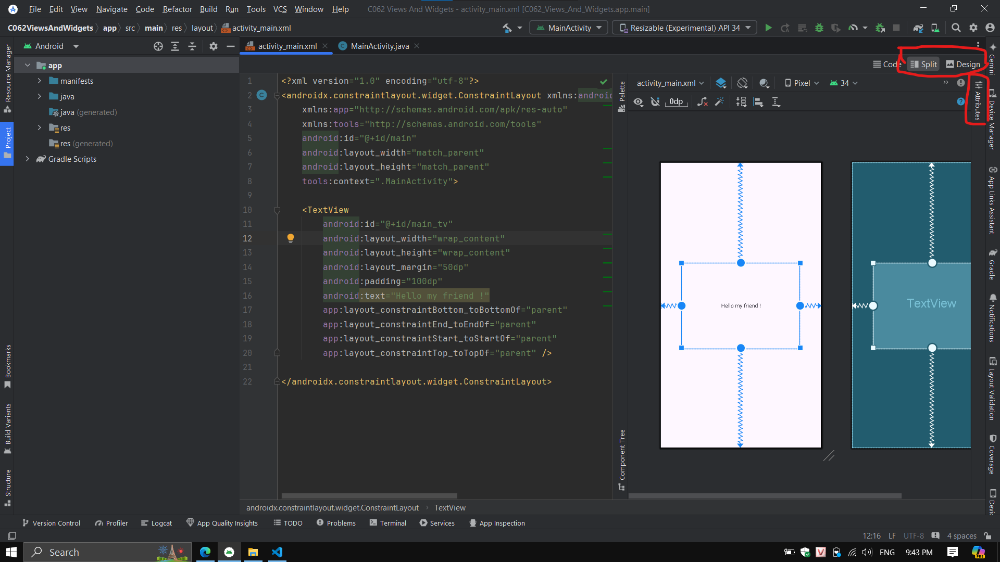
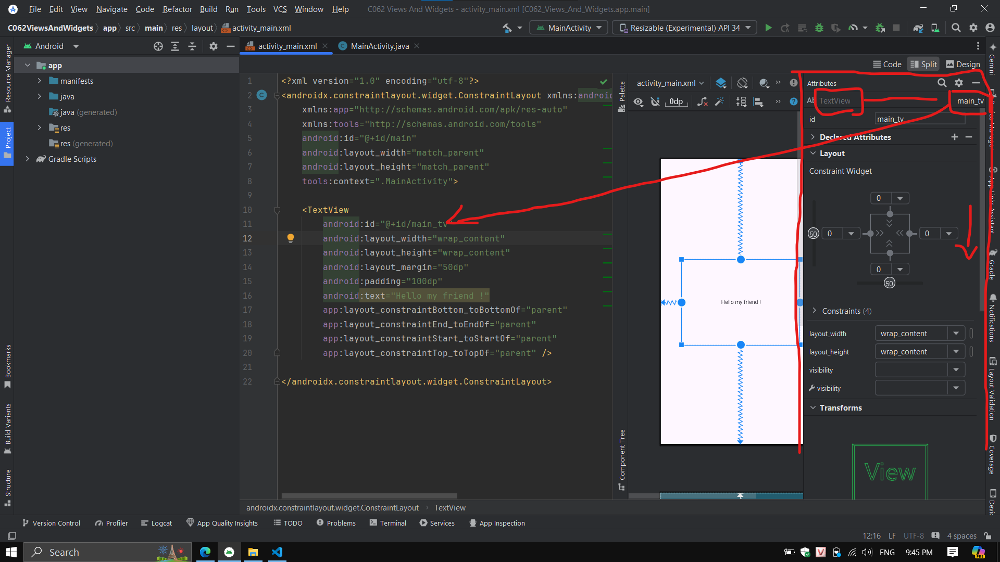

# __VIEWS AND WIDGETS__

## __VIEW AND VIEW GROUP__

- VIEW GROUP như là container chứa các VIEW
- VIEW là thành phần đơn giản biễu diễn phần tử trực quan như:
    - Button
    - TextView
    - ImageView
    - hoặc những phần tử tương tác khác
- Button, TextView, ImageView... được gọi là các View, và chúng kế thừa từ class View
- mỗi View như Button, TextView, ImageView... được sử dụng theo công việc chỉ định của chúng

- View Group là View nhưng nó có khả năng chứa các View khác bên trong nó
- View Group giúp tổ chức và sắp xếp các View trên màn hình
- các View Group thường hay sử dụng là các layout
    - LinearLayout
    - RelativeLayout
    - ConstraintLayout
    - GridLayout
    - TableLayout
    - FrameLayout
    - AdapterView
    - DrawerLayout

## __UI EDITING IN ANDROID STUDIO__

- khi tạo mới 1 project Android Empty Views Activity ta nhận được 2 file
    - ActivityMain file (.java hoặc .kotlin)
    - main_activity file (Layout file - .xml)
- XML file dùng để design UI cho Android App, ta sẽ sử dụng các attributes khác nhau của View để xác định cách các phần tử View hiển thị và hành động
- trong XML file ta sẽ có 3 tab tương ứng 3 cách dùng để design các View cho UI Android App
    - code (chỉ sử dụng code)
    - split (sử dụng cả code và drag drop mouse)
    - design (chỉ sử dụng drag drop mouse)


## __VIEWS ATTRIBUTES__

- mỗi View có rất nhiều attribute giống và khác nhau
- các attribute được sử dụng để tùy chỉnh cách mà các View xuất hiện, bố cụ, hành vi và tương tác
- cú pháp khai báo attribute: <br>__``android:attribute-name="attribute-value"``__

### __MỘT SỐ ATTRIBUTE THÔNG THƯỜNG__

- dưới đây là 1 số attribute thông thường mà đa số các View đều sở hữu
- ngoài ra, có những attribute đặc biệt chỉ có ở những View nhất định, dành cho những mục đích đặc biệt của View đó

#### __id__

- mỗi View đều có và duy nhất attribute id
- id của View cũng có thể được tham chiếu từ file chương trình Java hoặc Kotlin
- cú pháp: <br>__``android:id="@+id/id-name"``__

#### __layout_width__, __layout_height__

- layout_width và layout_height dùng để xác định chiều rộng và chiều cao của View
- cả 2 attribute này có thể mang các giá trị như:
    - wrap_content
    - match_parent
    - hoặc số đơn vị __dp__ (vd: 200dp)
- cú pháp: <br>__``android:layout_width="width-value"``__
- cú pháp: <br>__``android:layout_height="height-value"``__

#### __text__

- text là attribute của TextView và 1 số View có thể hiển thị text(vd: Button)
- attribute text sẽ chứa nội dung văn bản cần hiển thị
- cú pháp: <br>__``android:text="text-content"``__

#### __layout_margin__

- layout_margin chỉ định biên hoặc không gian trống xung quanh View tính từ đường viền của View đến các View khác
- cú pháp: <br>__``android:layout_margin="distance-value"``__

#### __padding__

- padding chỉ định khoảng trống đệm giữa nội dung bên trong View đến đường viền của View
- cú pháp: <br>__``android:padding="distance-value"``__

### __SỬ DỤNG ATTRIBUTE VIEW TRỰC QUAN__

- ngoài cách sử dụng các attribute của View bằng code XML, trong tab Split hoặc Design của Editor Layout, ta có thể chọn mục attributes để chỉnh sửa tất cả các attributes của View đang được chọn





## __TEXTVIEW__

- thực hiện design TextView trong layout và chỉnh sửa các attribute sau cho TextView
- id (id của TextView - quan trọng, mọi View, ViewGroup đều nên có id)
- text (nội dung text)
- textSize (kích thước text, đơn vị: sp)
- textColor (value là hex code của màu, có dạng: #000000)
- textStyle (bold, italic, normal)
- gravity (canh lề text so với khung chứa, với các giá trị như start, center, end, ...)
- typeface (font của text)
- textAllCaps (chuyển sang in hoa các ký tự, value là true hoặc false)
- padding (khoảng trống giữa nội dung so với khung chứa View)
- layout_margin (khoảng trống xung quanh khung chứa View)
- background (tô màu nền của chính View)
- inputType (kiểu ký tự nhận vào TextView)

> mặc định ViewGroup layout màn hình sẽ là ConstraintLayout, nên các View trong màn hình phải neo ít nhất 3 điểm của View lên ViewGroup, có thể thực hiện drag drop hoặc code xml


```
        app:layout_constraintBottom_toBottomOf="parent"
        app:layout_constraintEnd_toEndOf="parent"
        app:layout_constraintStart_toStartOf="parent"
        app:layout_constraintTop_toTopOf="parent"
```

- file xml
```xml
<?xml version="1.0" encoding="utf-8"?>
<androidx.constraintlayout.widget.ConstraintLayout xmlns:android="http://schemas.android.com/apk/res/android"
    xmlns:app="http://schemas.android.com/apk/res-auto"
    xmlns:tools="http://schemas.android.com/tools"
    android:id="@+id/main"
    android:layout_width="match_parent"
    android:layout_height="match_parent"
    tools:context=".MainActivity">

    <TextView
        android:id="@+id/myTextView"
        android:layout_width="wrap_content"
        android:layout_height="wrap_content"
        android:gravity="center"
        android:text="Hello Android !!!"
        android:textColor="#9C27B0"
        android:textSize="20sp"
        android:textStyle="bold"
        android:typeface="serif"
        android:textAllCaps="true"
        android:padding="10dp"
        android:layout_margin="20dp"
        android:background="#00BCD4"
        android:inputType="text"
        app:layout_constraintBottom_toBottomOf="parent"
        app:layout_constraintEnd_toEndOf="parent"
        app:layout_constraintStart_toStartOf="parent"
        app:layout_constraintTop_toTopOf="parent" />

</androidx.constraintlayout.widget.ConstraintLayout>
```


## __DECLARE & INITIAL VIEW OBJECT__

- để sử dụng và tương tác đến View được design trong layout XML, trong file chương trình Java hoặc Kotlin ta cần 
    - khai báo đối tượng của View cần tham chiếu
    - khởi tạo tham chiếu đến id của View đó trong layout
- sau khi hoàn thành 2 bước từ file chương trình ta có thể tương tác và sử dụng các View đã thiết kế trong layout
- phương thức khởi tạo của View là: __``findViewById(int)``__
- giá trị truyền vào findViewById là giá trị int của id, để lấy giá trị int của id ta sử dụng thư viện __``R.id.ID-NAME``__
- ví dụ: khai báo khởi tạo TextView có id: myTextView <br> __``TextView myTextView = findViewById(R.id.myTextView);``__

- sau khi Declare và Initial View, ta có được đối tượng View tham chiếu đến View trong layout, ta có thể sử dụng đối tượng View thông qua các phương thức của View cụ thể.
- ví dụ thay đổi nội dung của TextView với method ``setText``

```java
public class MainActivity extends AppCompatActivity {
    @Override
    protected void onCreate(Bundle savedInstanceState) {
        super.onCreate(savedInstanceState);
        setContentView(R.layout.activity_main);
        TextView myTextView = findViewById(R.id.myTextView);
        myTextView.setText("Hello, Change Text");
    }
}
```
- chạy chương trình
